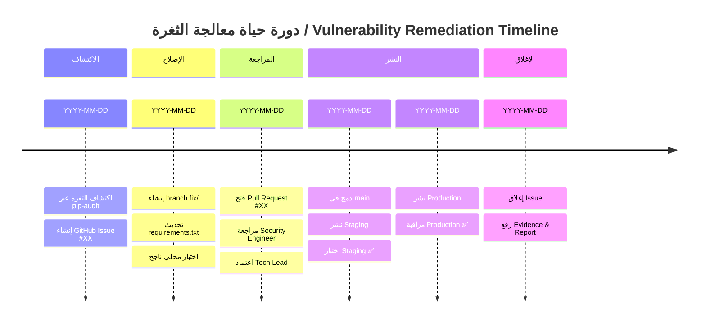

# نموذج تقرير التسليم النهائي / Final Submission Report Template
## عملية إصلاح ثغرات أمان التبعيات / Dependency Security Vulnerability Remediation

> **رقم التقرير / Report ID:** REP-SEC-`[YYYY-MM-DD]`-`[SEQ]`  
> **تاريخ الإعداد / Prepared:** `YYYY-MM-DD`  
> **مُعِد التقرير / Prepared by:** `[الاسم / Name]`  
> **مراجعة التقرير / Reviewed by:** `Tech Lead`  
> **المرجع / Reference:** `PR #XX` | `Issue #XX`

---

## 1. الملخص التنفيذي / Executive Summary

```
[اكتب ملخصاً في 3-5 أسطر يصف:
 - ماذا حدث (الثغرات المكتشفة)
 - ما الذي تم (الإصلاح)
 - النتيجة (الحالة الأمنية بعد الإصلاح)
 - أي توصيات فورية]
```

**مثال (PR #48):**
> اكتُشفت ثغرات أمنية حرجة في حزمتي `cryptography` (3 CVEs، max CVSS 7.5) و `langchain-community` (3 CVEs، max CVSS 9.0). تم تحديث الحزمتين في PR #48 مما أزال جميع الثغرات المكتشفة. تم نشر الإصلاح على بيئتي Staging والإنتاج بنجاح ولم تُسجَّل أي تراجعات.

---

## 2. قائمة الثغرات المعالجة / Remediated Vulnerabilities

| # | CVE ID | الحزمة / Package | CVSS | الخطورة | النوع | الإصدار قبل / Before | الإصدار بعد / After | الحالة |
|---|---|---|---|---|---|---|---|---|
| 1 | `CVE-XXXX-XXXXX` | `package` | `X.X` | Critical | RCE | `X.X.X` | `Y.Y.Y` | ✅ مُعالَج |
| 2 | | | | | | | | |
| 3 | | | | | | | | |

**إجمالي CVEs المعالجة:** `X` حالة  
**إجمالي الحزم المحدَّثة:** `X` حزمة  
**أعلى CVSS قبل الإصلاح:** `X.X`  
**أعلى CVSS بعد الإصلاح:** `0.0 (نظيف / Clean)`

---

## 3. الجدول الزمني الكامل / Complete Timeline



| المرحلة | التاريخ | المدة |
|---|---|---|
| الاكتشاف / Discovery | `YYYY-MM-DD` | `X ساعات` |
| إنشاء Issue / Issue Created | `YYYY-MM-DD` | |
| بدء الإصلاح / Fix Started | `YYYY-MM-DD` | |
| فتح PR / PR Opened | `YYYY-MM-DD` | |
| اكتمال المراجعة / Review Complete | `YYYY-MM-DD` | |
| الدمج / Merged | `YYYY-MM-DD` | |
| نشر Staging | `YYYY-MM-DD` | |
| نشر Production | `YYYY-MM-DD` | |
| الإغلاق / Closed | `YYYY-MM-DD` | |
| **إجمالي / Total** | | **`X` ساعة / hours** |

---

## 4. الملفات والتغييرات / Files & Changes

| الملف | نوع التغيير | التفاصيل |
|---|---|---|
| `src/backend/requirements.txt` | تحديث إصدار | `package X.X.X → Y.Y.Y` |
| `ai/requirements.txt` | تحديث إصدار | `package X.X.X → Y.Y.Y` |

**إجمالي الملفات المعدّلة:** `X`  
**إجمالي الأسطر المعدّلة:** `X` سطر

---

## 5. نتائج الاختبار الختامية / Final Test Results

### مسح أمني ما بعد النشر / Post-Deploy Security Scan

```bash
# مخرجات pip-audit النهائية على بيئة Production
# [الصق المخرجات الفعلية هنا]
```

| أداة الفحص | النتيجة | ثغرات متبقية |
|---|---|---|
| `pip-audit` | ✅ نظيف | 0 |
| `safety check` | ✅ نظيف | 0 |

### اختبارات التراجع / Regression Tests

| مجموعة الاختبارات | عدد الاختبارات | ناجح | فاشل | نسبة النجاح |
|---|---|---|---|---|
| Unit Tests | `X` | `X` | `0` | `100%` |
| Integration Tests | `X` | `X` | `0` | `100%` |
| Security Scan | `X` | `X` | `0` | `100%` |

### مقاييس Production / Production Metrics

| المقياس | قبل / Before | بعد / After | التغيير |
|---|---|---|---|
| Error Rate | `X%` | `X%` | `±X%` |
| P95 Response Time | `X ms` | `X ms` | `±X ms` |
| Availability | `X%` | `X%` | `±X%` |

---

## 6. الدروس المستفادة / Lessons Learned

### ما سار بشكل جيد / What Went Well

```
1. [مثال: اكتشاف الثغرة مبكراً عبر pip-audit]
2. [مثال: وضوح خطوات SOP تسهيل عملية الإصلاح]
3.
```

### ما يمكن تحسينه / What Could Be Improved

```
1. [مثال: أتمتة فحص pip-audit في CI/CD pipeline]
2. [مثال: إضافة Dependabot لتلقي تنبيهات فورية]
3.
```

### إجراءات التحسين المقترحة / Proposed Improvement Actions

| الإجراء | المسؤول | الأولوية | الموعد المقترح |
|---|---|---|---|
| `[مثال: إضافة pip-audit في GitHub Actions]` | DevOps Engineer | High | `YYYY-MM-DD` |
| | | | |
| | | | |

---

## 7. التوصيات للمستقبل / Future Recommendations

### توصيات تقنية / Technical Recommendations

- [ ] تفعيل **Dependabot** لمراقبة التبعيات تلقائياً
- [ ] إضافة `pip-audit` كـ step في كل CI/CD run
- [ ] تثبيت جميع إصدارات التبعيات (pinned versions) لتسهيل المراجعة
- [ ] إضافة `safety` كـ pre-commit hook
- [ ] دراسة استخدام **renovatebot** لأتمتة تحديثات الأمان

### توصيات إجرائية / Process Recommendations

- [ ] مراجعة SOP كل 6 أشهر وتحديثه بالدروس المستفادة
- [ ] تنظيم Vulnerability Response Drill كل ربع سنة
- [ ] إضافة Security Awareness training للمطورين الجدد

---

## 8. مقاييس الجودة (KPIs) / Quality Metrics (KPIs)

| المقياس / KPI | الهدف / Target | المُحقَّق / Achieved | الحالة |
|---|---|---|---|
| **وقت الاكتشاف للإصلاح / MTTD-to-Fix** | < 72h (High) | `X h` | ✅ / ❌ |
| **وقت الاستجابة الأولية / Initial Response** | < 4h (Critical) | `X h` | ✅ / ❌ |
| **نسبة نجاح الاختبارات / Test Pass Rate** | 100% | `X%` | ✅ / ❌ |
| **CVEs المعالجة / CVEs Remediated** | 100% | `X/X` | ✅ / ❌ |
| **تراجعات Staging / Staging Regressions** | 0 | `X` | ✅ / ❌ |
| **تراجعات Production / Prod Regressions** | 0 | `X` | ✅ / ❌ |
| **وقت النشر الكلي / Total Deploy Time** | < 30 min | `X min` | ✅ / ❌ |

---

## 9. التوقيعات / Sign-off

| الدور | الاسم | التوقيع | التاريخ |
|---|---|---|---|
| **مُعِد التقرير / Report Author** | | | |
| **Security Engineer** | | | |
| **Tech Lead (مراجع / Reviewer)** | | | |
| **DevOps Engineer** | | | |

---

## 10. المرفقات / Attachments

- [ ] نموذج Evidence (`templates/evidence-template.md`) مكتمل
- [ ] نموذج Approval Request (`templates/approval-request.md`) موقَّع
- [ ] مخرجات `pip-audit` (قبل وبعد)
- [ ] سجل CI/CD Runs
- [ ] سجل pytest
- [ ] لقطات شاشة من بيئة Production (اختياري)

---

> 📦 **أرشفة:** يُحفظ هذا التقرير في `docs/security-sop/records/REP-SEC-[YYYY-MM-DD]-[SEQ].md`  
> ويُرتبط بالـ Issue والـ PR ذوي الصلة.
