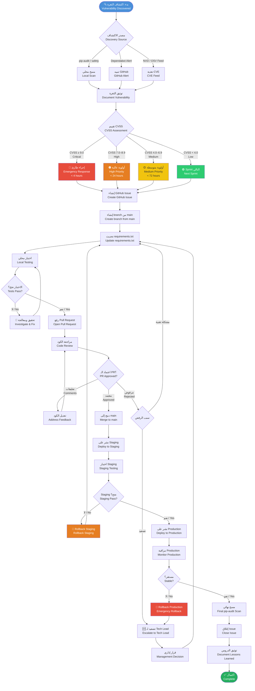
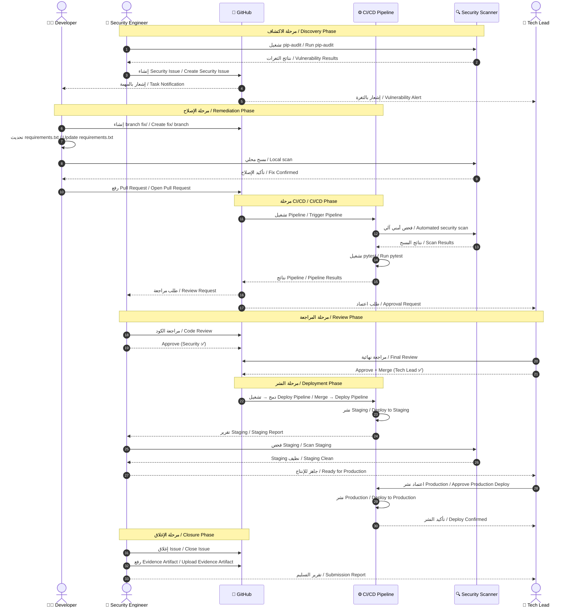
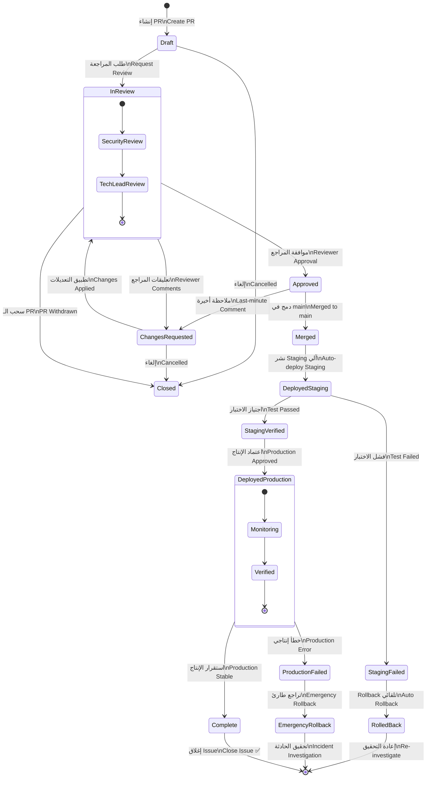
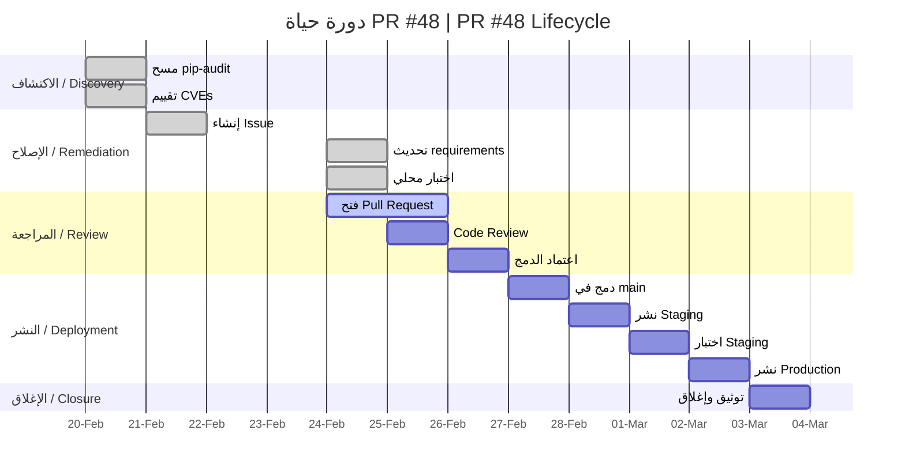

# مخططات سير العمل / Workflow Diagrams

> **الإصدار / Version:** 1.0 | **المرجع / Reference:** PR #48

---

## 1. Flowchart – دورة حياة معالجة الثغرة الأمنية

---

## 2. Sequence Diagram – تفاعل الأدوار

---

## 3. State Diagram – حالات الـ Pull Request

---

## 4. Timeline Diagram – مثال PR #48

