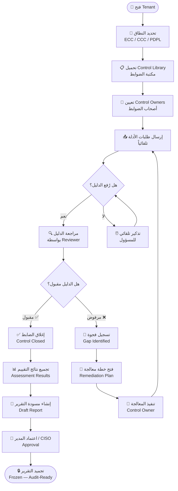
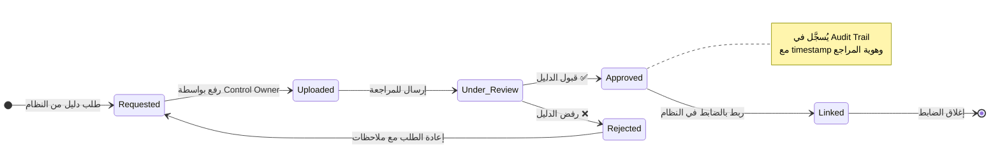
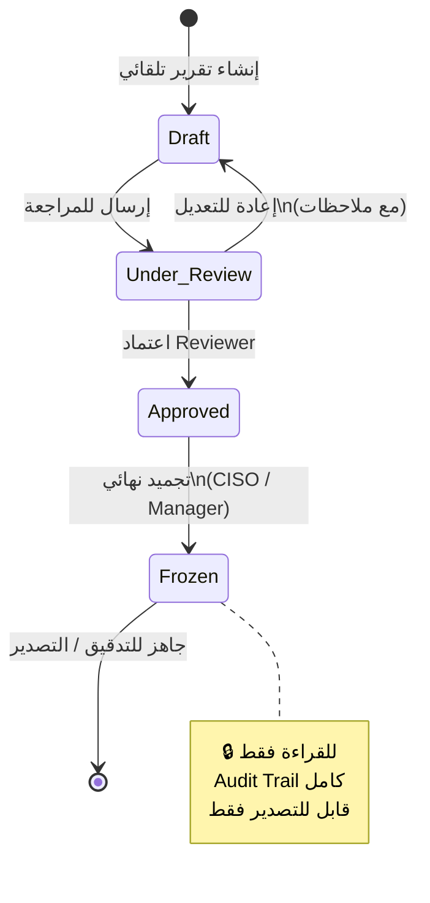
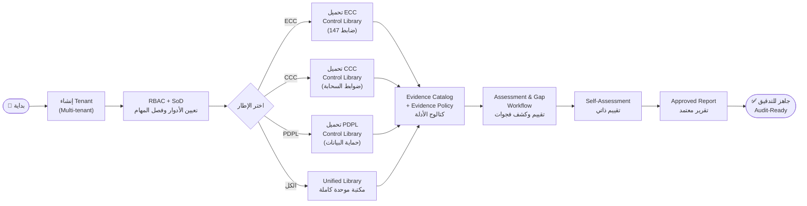
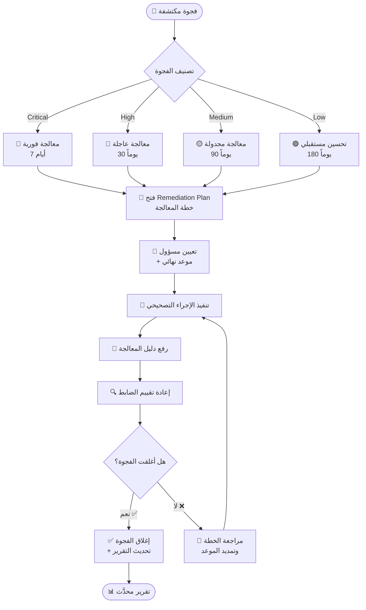
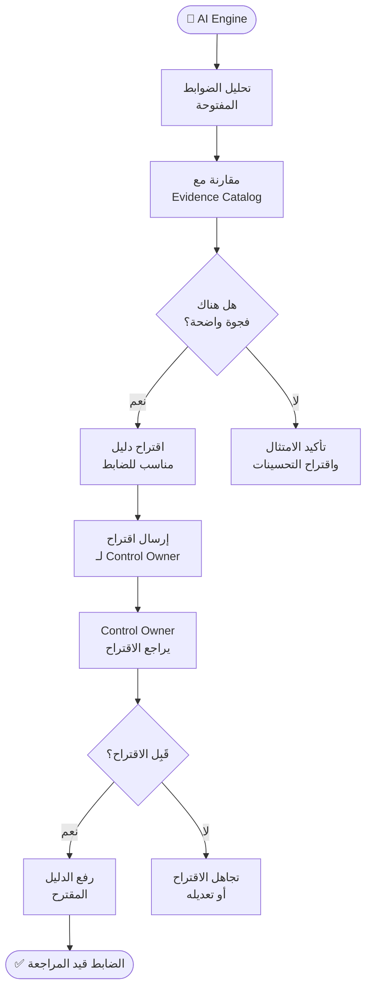

# 🔄 Workflow Diagrams — مخططات سير العمل
# SICO GRC Platform

**الإصدار:** 1.0  
**تاريخ:** 2026-02-24

---

## Workflow 1 — دورة حياة الضابط الكاملة (Control Lifecycle)

---

## Workflow 2 — دورة الأدلة (Evidence Lifecycle)

---

## Workflow 3 — دورة التقرير (Report Lifecycle)

---

## Workflow 4 — مسار Onboarding (P1 Priority)

---

## Workflow 5 — مسار المعالجة (Remediation Flow)

---

## Workflow 6 — مسار AI (Evidence Gap Suggestions)

